Probability and Pseudorandom Numbers
====================================

Before we make our way into sampling distributions, let introduce some
terminology, which may be useful when talking to statisticians.

-  Basics of Probability
-  Pseudorandom Numbers
-  Some standard 1D distributions

Basics of Probability and Distributions
---------------------------------------

Let us consider the following topics

-  Population and Samples
-  Random Variable
-  PDF and CDF

for context, before moving on to study the generation of pseudorandom
numbers

Population and Sample
~~~~~~~~~~~~~~~~~~~~~

**Population**: It is the set of all entities that are the object of a
statisticians interest e.g: all American males, graduate students at
FSU, all US voters

**Sample**: a *subset* of the population which are observed

Typically, the aim is to make inferences about the population from the
sample. As you may have guessed constructing a “representative” sample
is key.

“double-blind randomized control trials” are the gold-standard in many
fields to study effects of intervention.

*Bad*: using NBA players to estimate the height of an American male

*Bad*: using New York voters to predict the outcome of a presidential
race.

.. code:: ipython3

    # Standard Imports
    import numpy as np
    np.random.seed(0)
    
    import matplotlib.pyplot as plt
    plt.style.use('seaborn')
    
    # Custom plot settings
    import matplotlib as mpl
    mpl.rcParams['lines.linewidth'] = 2
    mpl.rcParams['axes.labelsize'] = 'Large'
    mpl.rcParams['xtick.labelsize'] = 'Large'
    mpl.rcParams['ytick.labelsize'] = 'Large'
    
    # Jupyter Notebook Settings
    %matplotlib inline
    %config InlineBackend.figure_format = 'svg'

Random Variable
~~~~~~~~~~~~~~~

A random variable is a well-defined attribute of entities in a
population.

Examples of population : random variable \* all American males : height
\* FSU graduate students : GPA

The random variable may be discrete or continuous

-  Continuous

   -  person’s height or weight
   -  finish times at a marathon
   -  fraction of women in a population

-  Discrete

   -  roll of a die
   -  result of coin toss
   -  number of children per household

PDF and CDF
~~~~~~~~~~~

The distribution of random variables can be described by the so-called
*probability distribution function*, or the *probability density
function*. Luckily the abbreviation for both of them is the same - PDF.

For example, the roll of a die may be described by the following PDF.

.. math:: p(x) = \frac{1}{6},~~~ x \in \{1,2, .., 6\}

This essentially says that the probability of any outcome :math:`x` is
equal. Thus, the probability :math:`p(x=3) = p(x=1) = 1/6`.

.. code:: ipython3

    # extract two colors scheme from 
    c1=list(plt.rcParams['axes.prop_cycle'])[1]['color']
    c2=list(plt.rcParams['axes.prop_cycle'])[0]['color']
    
    xi = np.array([1., 2., 3., 4., 5., 6.])
    ui = 1./6
    for pt in xi:
        plt.plot([pt, pt],[0., ui],'-', color=c1)
        plt.plot(pt, ui,'o', color=c2)
    plt.xlabel('x', fontsize=18)
    plt.ylabel('p(x)', fontsize=18)
    plt.xlim(0,7)
    plt.ylim(0,0.5)
        
    #plt.savefig('disc.pdf')

.. parsed-literal::

    (0, 0.5)

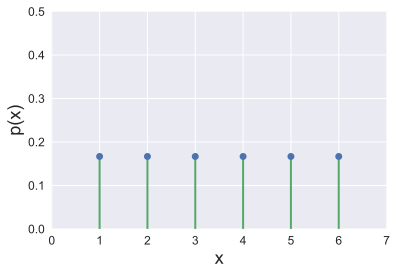

Note that the sum

.. math:: \sum_{x=1}^{x=6} p(x) = 1.

This is a *normalized* discrete PDF.

As an example of a continuous PDF, consider the heights of American
males or females. Perhaps it can be described by a *normal*
distribution, which we will see later.

.. math:: p(x) = \frac{1}{\sqrt{2 \pi \sigma^2}} \exp\left(- \frac{(x-\mu)^2}{2 \sigma^2} \right), ~~~x \in (-\infty, \infty)

**Note** : actual data for men fits :math:`\mu = 69.3`, and
:math:`\sigma = 3.0` inches, while for women, :math:`\mu = 64.0` and
:math:`\sigma = 3.0` inches.

*Interpretation*: The probability of the height lying between :math:`x`
and :math:`x+dx` is given by :math:`p(x) dx`.

.. code:: ipython3

    xi = np.linspace(3.5, 8,500)
    mu = 69.3/12.0 # inches -> feet, for women 64 inches
    sigma = 3.0/12.0 # inches
    yi = mpl.mlab.normpdf(xi, mu, sigma)
    plt.plot(xi,yi)
    
    xi = np.linspace(5.9, 6.1, 10)
    yi = mpl.mlab.normpdf(xi, mu, sigma)
    plt.fill_between(xi, 0, yi, facecolor=c2, alpha=0.4)
    
    #plt.xlim(4,8)  # set up the plot limits
    plt.xlabel('x', fontsize=18)
    plt.ylabel('p(x)', fontsize=18)
        
    #plt.savefig('c.pdf')

.. parsed-literal::

    Text(0,0.5,'p(x)')

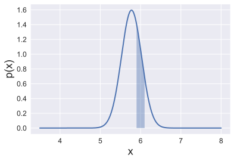

The area of the shaded area represents the probability that the height
of a randomly chosen individual from this population has a height
between 5.9 to 6.1 feet.

The normalization condition on continuous PDFs is

.. math:: \int_{-\infty}^{\infty} p(x) dx = 1.

In other words, the area under the curve is one.

The corresponding *normalization* condition for discrete PDFs is

.. math:: \sum_{x = -\infty}^{\infty} p(x) dx = 1.

The *cumulative distribution function* or CDF :math:`F(x)` represents
the probability that the random variable :math:`X \leq x`.

For a discrete PDF, :math:`p(x)`,

.. math:: F(x) = \sum_{X=-\infty}^{x} p(X)

For the roll of a die:

.. math::

   F(x) = \begin{cases}
           0, \quad \quad x < 1 \\
           x/6, \quad  1 \leq x \leq 6 \\
           1, \quad \quad x > 6
          \end{cases}

.. code:: ipython3

    xi = np.array([0, 0.999, 1., 2., 3., 4., 5., 6., 7])
    ui = 1./6. * xi
    ui[0] = 0.
    ui[1] = 0.
    ui[-1] = 1.
    
    plt.plot(xi,ui, '-', color=c1)
    plt.plot(xi[2:-1],ui[2:-1], 'o', color=c2)
    
    plt.xlabel('x', fontsize=18)
    plt.ylabel('F(x)', fontsize=18)
    plt.xlim(0,7)
    plt.ylim(-0.1,1.1)
    plt.tight_layout()
    #plt.savefig('d.pdf')

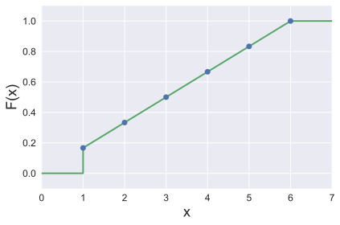

For a continuous PDF,

.. math:: F(x) = \int_{X=-\infty}^{x} p(X) dX

.. code:: ipython3

    from scipy import integrate
    
    xi = np.linspace(3.5, 8,500)
    mu = 69.3/12.0 
    sigma = 3.0/12.0 
    yi = integrate.cumtrapz(mpl.mlab.normpdf(xi, mu, sigma), xi, initial=0.)
    plt.plot(xi,yi,label='CDF')
    plt.plot(xi, mpl.mlab.normpdf(xi, mu, sigma), label='PDF')
    plt.ylim(0.0, 2.0)
    plt.xlabel('x', fontsize=18)
    plt.ylabel('p(x) and F(x)', fontsize=18)
    plt.legend()

.. parsed-literal::

    <matplotlib.legend.Legend at 0x11f221828>

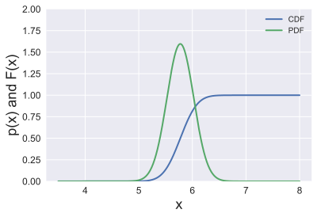

We can get the PDF from the CDF:

Discrete distributions

.. math:: p(x) = F(x) - F(x-1)

Continuous distributions

.. math:: p(x) = \frac{dF(x)}{dx}

Pseudorandom Numbers
--------------------

We will first discuss the generation of pseudo-random numbers
:math:`x \in [0, 1]` from the uniform distribution. Once we have these,
we can sample pretty much any distribution we care for.

Uniform Random Number Generators: generate a random number :math:`x`
uniformly distributed between 0 and 1.

.. math:: u(x) = \begin{cases} 1, \quad \quad 0 \leq x < 1 \\ 0, \quad \quad \text{elsewhere} \end{cases}

.. code:: ipython3

    xi = np.linspace(-0.1,1.1,1000)
    ui = np.ones(len(xi))
    ui[xi < 0] = 0.
    ui[xi > 1.] = 0.
    
    plt.plot(xi,ui)
    plt.fill_between(xi, 0, ui, facecolor=c2, alpha=0.2)
    
    plt.xlabel('x', fontsize='18')
    plt.ylabel('u(x)', fontsize='18')
    plt.ylim(-0.01,1.1)
    plt.xlim(-0.1, 1.1)
    # plt.savefig('c.pdf')

.. parsed-literal::

    (-0.1, 1.1)

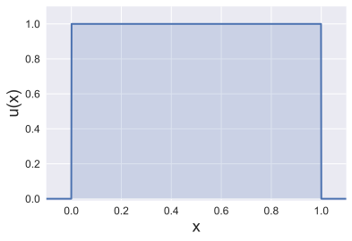

The idea is to “toss a coin” for a (say) 32-bit binary number, so that
each of the :math:`2^{32}` possibilities

.. math::

   \begin{gather}
   0000 \dots 000 \\
   0000 \dots 001 \\
   0000 \dots 010 \\
   0000 \dots 011 \\
   \vdots \\
   1111 \dots 111
   \end{gather}

is visited in an “apparently” random fashion.

Usually the random numbers are based on a deterministic algorithm and
hence called “pseudo”-random.

Linear Congruential Generators
~~~~~~~~~~~~~~~~~~~~~~~~~~~~~~

The simplest RNGs are linear congruential sequence RNGs.

They involve multiplication and truncation of leading bits of a number.

.. math:: n_{i+1} = (a n_i) \mod m,

where :math:`n_i` is an integer, :math:`a` is the multiplier, and
:math:`m` is the modulus.

:math:`x \mod y` is the modulo operator, e.g.,
:math:`8\mod3 = 2,\, 5 \mod 5 = 0`.

:math:`n_0`, the initial seed has to be supplied. Thus, a particular
choice of :math:`a` and :math:`m` specify a particular method.

To get a real number between 0 and 1, compute :math:`n_i/m`, which is
guaranteed to be less than 1.

.. code:: ipython3

    def LinCongGen(a, m, n0, num):
        # returns "num" integers "n"
        n = np.zeros(num, dtype=np.int)
        n[0] = n0
        
        for i in range(1,num):
            n[i] = a * n[i-1] % m # % = modulo operator in python
            
        return n

Not all choices of :math:`a` and :math:`m` result in a good RNG. For an
example of a bad choice, consider :math:`a=3, m=7`.

.. code:: ipython3

    print (LinCongGen(3, 7, 12, 50))

.. parsed-literal::

    [12  1  3  2  6  4  5  1  3  2  6  4  5  1  3  2  6  4  5  1  3  2  6  4  5
      1  3  2  6  4  5  1  3  2  6  4  5  1  3  2  6  4  5  1  3  2  6  4  5  1]

Notice that the sequence 1, 3, 2, 6, 4, 5 is periodic. Let us try a
different seed :math:`n_0`.

.. code:: ipython3

    print (LinCongGen(3, 7, 8, 50))

.. parsed-literal::

    [8 3 2 6 4 5 1 3 2 6 4 5 1 3 2 6 4 5 1 3 2 6 4 5 1 3 2 6 4 5 1 3 2 6 4 5 1
     3 2 6 4 5 1 3 2 6 4 5 1 3]

No luck. In general, we should choose an :math:`m` that is very large -
usually something close to the maximum number on the computer to delay
the periodic behavior as much as possible.

Consider a better choice: :math:`a = 16807` and :math:`m = 2147483647`.

.. code:: ipython3

    a = 16807
    m = 2147483647
    x = LinCongGen(a, m, 12, 10000).astype(float)/m
    plt.hist(x, 20, normed=1, facecolor='green', alpha=0.9, rwidth=.9)
    plt.xlabel('x', fontsize='18')
    plt.ylabel('p(x)', fontsize='18')

.. parsed-literal::

    Text(0,0.5,'p(x)')

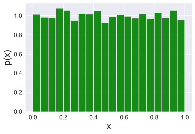

Flat histograms, while a useful diagnostic measure, is not sufficient.

A famous disastrous bad choice is the RANDU RNG, which used
:math:`a=65539` and :math:`m = 2^{31}`. The histogram looks flat enough
…

.. code:: ipython3

    a = 65539
    m = 2**31
    x = LinCongGen(a, m, 12, 9999).astype(float)/m
    plt.hist(x, 20, normed=1, facecolor='green', alpha=0.9, rwidth=0.9)
    plt.xlabel('x', fontsize='18')
    plt.ylabel('p(x)', fontsize='18')

.. parsed-literal::

    Text(0,0.5,'p(x)')

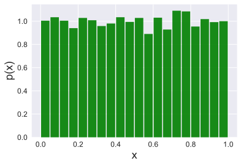

But if you plot three successive deviates in 3D you see a disturbing
pattern, if you look at it from the right angle.

.. code:: ipython3

    a = 65539
    m = 2**31
    x = LinCongGen(a, m, 12, 999).astype(float)/m
    
    from mpl_toolkits.mplot3d import Axes3D
    fig = plt.figure()
    ax = fig.add_subplot(111, projection='3d')
    ax.scatter(x[0::3], x[1::3], x[2::3],'.',color=c2)

.. parsed-literal::

    <mpl_toolkits.mplot3d.art3d.Path3DCollection at 0x11f3f97b8>

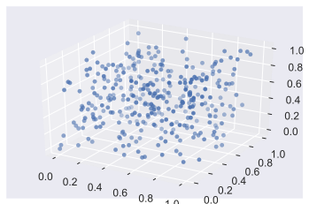

.. code:: ipython3

    fig = plt.figure()
    ax = fig.add_subplot(111, projection='3d')
    ax.view_init(9, 57) # this adjusts the viewing angle
    ax.scatter(x[0::3], x[1::3], x[2::3],'.', color=c2)
    # plt.savefig('c.pdf')

.. parsed-literal::

    <mpl_toolkits.mplot3d.art3d.Path3DCollection at 0x11f4c8550>

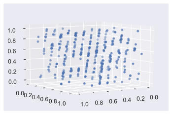

Sophisticated RNGs
~~~~~~~~~~~~~~~~~~

What makes for a good RNG?

-  meet statistical tests

   -  What is the period of the algorithm?
   -  Is histogram uniform?
   -  Systematic correlation of deviates?
   -  Florida State: Marsaglia, Diehard Battery of Tests for Randomness

Good RNGs include:

-  Mersenne-Twister

-  SIMD-oriented Fast Mersenne-Twister

-  Well Equidistributed Long-period Linear (WELL)

-  Xorshift

Most built-in RNGs probably belong to the second category. You should
find out what a good RNG is for your favorite platform.

Standard Distributions
----------------------

Many libraries are available to generate random numbers from special
standard families. If you can’t find these for your system, do not fret.
As long as you have a decent uniform random number generator, you can
generate random numbers from any other distribution.

Let us catalog some standard distributions first by specifying the PDF,
the CDF, and two other quantities.

-  The **mean** or **expected value** of a random variable

Discrete distribution

.. math:: E[x] = \sum_{x=-\infty}^{\infty} x p(x)

Continuous distribution

.. math:: E[x] = \int_{-\infty}^{\infty} x p(x) dx

related is the expected value of a function :math:`g(x)` of the random
variable.

Discrete distribution

.. math:: E[g] = \sum_{x=-\infty}^{\infty} g(x) p(x)

Continuous distribution

.. math:: E[g] = \int_{-\infty}^{\infty} g(x) p(x) dx

-  The **variance** of the random variable

.. math:: V[x] = E[x^2] - E[x]^2.

Discrete Distributions
~~~~~~~~~~~~~~~~~~~~~~

Let us catalog some discrete distributions first

Uniform
^^^^^^^

Example: a roll of a die

More generally,

.. math:: p(x) = \frac{1}{n},~~~ x \in \{a_1, a_2, .., a_n\}

where :math:`a_i` are the (exhaustive set of) different possible
outcomes.

Binomial
^^^^^^^^

Consider :math:`N` trials of an experiment with possible outcomes
“success” or “failure” (“heads” or “tails”, 0 or 1 etc.)

Suppose the probability of “success” is :math:`p`

The discrete random number :math:`n` is the number of successes

Probability of a particular outcome say ‘ssffs’ is

:math:`p p (1-p) (1-p) p = p^3 (1-p)^2`

Suppose, the order of successes and failures is unimportant (ssffs
:math:`\leftrightarrow` sssff :math:`\leftrightarrow` sfsfs
:math:`\leftrightarrow` etc.). Then the number of ways to generate
:math:`n` successes and :math:`N-n` failures is

.. math:: {}^{N}C_{n} = \dfrac{N!}{(N-n)!n!}

The binomial distribution of :math:`n` successes in :math:`N` trials,
when :math:`p` is the probability of success is given by

.. math:: f(n; N, p) = \dfrac{N!}{(N-n)!n!} p^n (1-p)^N

.. code:: ipython3

    def binomialdist(N, p):
        from scipy.special import comb
        
        n = np.arange(0,N+1)
        f = np.zeros((n.shape))
        
        for i in np.arange(0,N+1):
            f[i] = comb(N, n[i]) * p**n[i] * (1-p)**(N-n[i])
        
        return n, f

.. code:: ipython3

    fig, axarr = plt.subplots(3, sharex=True)
    
    N_list = [5, 10, 20]
    for i, N in enumerate(N_list):
        n, f = binomialdist(N, 0.5)
        axarr[i].plot(n, f, 'o')
        
        start, end = axarr[i].get_xlim()
        axarr[i].xaxis.set_ticks(np.arange(0,end,5))
        axarr[i].set_ylim(-0.02, 0.4)
        
    axarr[0].set_title('N = 5, 10, 20; p = 0.5', fontsize='20')
    axarr[2].set_xlabel('n', fontsize='18')

.. parsed-literal::

    Text(0.5,0,'n')

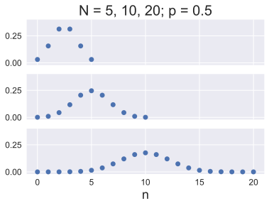

.. code:: ipython3

    fig, axarr = plt.subplots(3, sharex=True)
    
    p_list = [0.1, 0.2, 0.3]
    for i, p in enumerate(p_list):
        n, f = binomialdist(20, p)
        axarr[i].plot(n, f, 'o')
        
        start, end = axarr[i].get_xlim()
        axarr[i].xaxis.set_ticks(np.arange(0,end,5))
        axarr[i].set_ylim(-0.02, 0.4)
        
    axarr[0].set_title('N = 10; p = 0.1, 0.2, 0.3', fontsize='20')
    axarr[2].set_xlabel('n', fontsize='18')

.. parsed-literal::

    Text(0.5,0,'n')

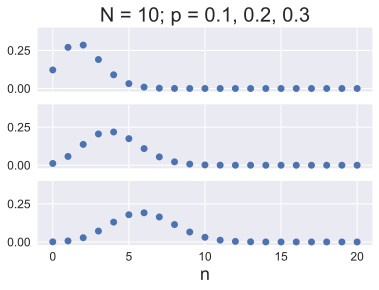

For the binomial distribution :math:`E[x] = Np` and
:math:`V[x] = Np(1-p)`.

Poisson Distribution
^^^^^^^^^^^^^^^^^^^^

Wikipedia has a succinct description:

::

   The Poisson distribution expresses the probability of a given 
   number of events occurring in a fixed interval of time and/or 
   space if these events occur with a known average rate and 
   independently of the time since the last event.

For instance, an individual keeping track of the amount of mail they
receive each day may notice that they receive an average number of 4
letters per day. If receiving any particular piece of mail doesn’t
affect the arrival times of future pieces of mail, i.e., if pieces of
mail from a wide range of sources arrive independently of one another,
then a reasonable assumption is that the number of pieces of mail
received per day obeys a Poisson distribution.

Other examples that may follow a Poisson: the number of \* phone calls
received by a call center per hour \* decay events per second from a
radioactive source \* taxis passing a particular street corner per hour.

The probability of observing :math:`k` events in an interval where the
average rate is :math:`\lambda` is given by:

.. math:: f(k; \lambda) = \frac{\lambda^k e^{-\lambda}}{k!}, ~~~ k = 0, 1, ..., \infty

.. code:: ipython3

    def PoissonDist(lam, kvec):
        from math import factorial, exp
        
        fvec = np.zeros(kvec.shape)
        i    = 0
        for k in kvec:
            fvec[i] = lam**k * exp(-lam)/factorial(k)
            i = i + 1
            
        return fvec
    
    kvec = np.arange(0,20)
    f0 = PoissonDist(0.5, kvec)
    f1 = PoissonDist(3.0, kvec)
    f2 = PoissonDist(6.0, kvec)
    plt.plot(kvec,f0, 'o-',label='$\lambda$ = 0.5')
    plt.plot(kvec,f1, 'o-',label='$\lambda$ = 3.0')
    plt.plot(kvec,f2, 'o-',label='$\lambda$ = 6.0')
    
    plt.xlabel('x', fontsize='18')
    plt.ylabel('f(x)', fontsize='18')
    plt.legend()
    #plt.grid()

.. parsed-literal::

    <matplotlib.legend.Legend at 0x11f8b1da0>

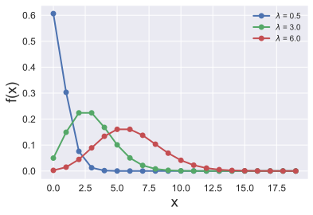

The mean and variance of the Poisson distribution are both equal to
:math:`\lambda`.

Continuous Distributions
~~~~~~~~~~~~~~~~~~~~~~~~

Uniform
^^^^^^^

A general continuous uniform distribution function has the form:

.. math:: f(x) = \begin{cases} \frac{1}{b-a} & \text{ for } a \leq x \leq b \\ 0 & \text{ elsewhere}.\end{cases}

As a particular example consider :math:`a = -1`, and :math:`b = 1`.

The PDF then looks like the following:

.. code:: ipython3

    a, b = -1.0, 1.0
    x = np.linspace(a, b)
    f = 1./(b-a) * np.ones(x.shape)
    plt.plot(x,f)
    plt.xlabel('x', fontsize='18')
    plt.ylabel('f(x)', fontsize='18')
    plt.fill_between(x, 0, f, facecolor=c2, alpha=0.2)
    plt.xlim(-1.1,1.1)
    plt.ylim(0,0.6)

.. parsed-literal::

    (0, 0.6)

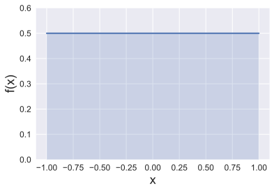

The mean :math:`E[x] = (a+b)/2`.

Exercise: Calculate the variance :math:`V[x]` by computing the integral

.. math:: E[x^2] = \int_{a}^{b} x^2 f(x) dx

Gaussian or Normal Distribution
^^^^^^^^^^^^^^^^^^^^^^^^^^^^^^^

We have seen the Gaussian distribution before:

.. math:: p(x) = \frac{1}{\sqrt{2 \pi \sigma^2}} \exp\left( -\frac{(x-\mu)^2}{2 \sigma^2} \right), ~~~x \in (-\infty, \infty)

The variance is :math:`\sigma^2` and the mean is :math:`\mu`.

.. code:: ipython3

    xi = np.linspace(3.5, 8,500)
    mu = 69.3/12.0 
    sigma = 3.0/12.0 
    yi = mpl.mlab.normpdf(xi, mu, sigma)
    plt.plot(xi,yi)
    
    plt.xlabel('x', fontsize=18)
    plt.ylabel('p(x)', fontsize=18)

.. parsed-literal::

    Text(0,0.5,'p(x)')

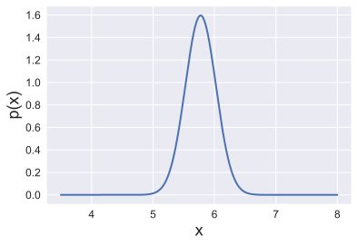

Exponential Distribution
^^^^^^^^^^^^^^^^^^^^^^^^

The exponential distribution is closely related to the Poisson
distribution.
(`Explanation <https://www.statlect.com/probability-distributions/Poisson-distribution>`__)

It describes the time between events in a Poisson process, i.e. a
process in which events occur continuously and independently at a
constant average rate.

.. math::

   f(x;\lambda) = \begin{cases}
   \lambda e^{-\lambda x} & x \ge 0, \\
   0 & x < 0.
   \end{cases}

For the three Poisson distributions considered previously:

.. code:: ipython3

    x = np.linspace(0,5)
    
    lam_list = [0.5, 3.0, 6.0]
    for lam in lam_list:
        f0 = lam*np.exp(-lam*x)
        plt.plot(x, f0, label='$\lambda$ = ' + str(lam))
    
    plt.xlabel('x', fontsize='18')
    plt.ylabel('f(x)', fontsize='18')
    plt.legend()

.. parsed-literal::

    <matplotlib.legend.Legend at 0x11f989278>

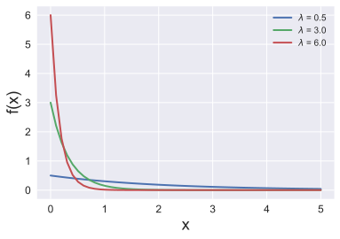

The mean and the variance of the Poisson distribution are
:math:`1/\lambda` and :math:`1/\lambda^2` respectively.

SciPy Distributions
-------------------

Consider the `lognormal
distribution <https://en.wikipedia.org/wiki/Log-normal_distribution>`__:

.. math:: \frac 1 {x\sigma\sqrt{2\pi}}\ e^{-\frac{\left(\ln x-\mu\right)^2}{2\sigma^2}}

Some initial setup to make sure distributions are described similarly

.. code:: ipython3

    from scipy.stats import lognorm
    
    # standard distribution specfiers
    sigma = 0.5
    mu    = 0.5
    
    # SciPy translation (from documentation)
    s     = sigma
    loc   = 0.
    scale = np.exp(mu)
    
    # ppf = inverse of cdf
    # finds relevant range over which PDF is nonzero
    x = np.linspace(lognorm.ppf(0.001, s), 
                    lognorm.ppf(0.999, s), 100) 
    plt.xlim(min(x), max(x))
    
    # plot CDF and PDF
    plt.plot(x, lognorm.pdf(x, s, loc, scale), lw=3, label='pdf')
    plt.plot(x, lognorm.cdf(x, s, loc, scale), lw=3, label='cdf')
    
    # sample from distribution
    r = lognorm.rvs(s, loc, scale, size=1000)
    plt.hist(r, 50, normed=True, histtype='stepfilled', alpha=0.4)
    plt.legend(loc='upper left')
    plt.savefig('scipy.pdf')

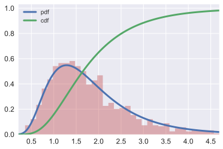

